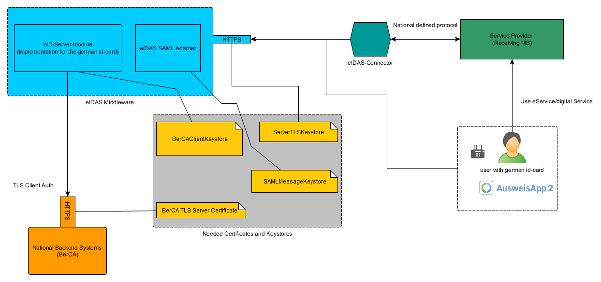

.. _configuration-mw:

Configuration of the eIDAS Middleware application
=================================================

Necessary keys and certificates
-------------------------------

In order to setup the middleware you will need to provide some keystores. The following overview illustrates the required certificates and keystores.

The following table describes the individual keystores:

+-----------------------------------+--------------------------------------+
| Keystore name                     | Description                          |
+===================================+======================================+
|BerCAClientKeystore                | This keystore is needed to           |
|                                   | access the :term:`Authorization CA`. |
|*File: POSeIDAS.xml*               |                                      |
+-----------------------------------+--------------------------------------+
|ServerTLSKeystore                  | This keystore is used to setup       |
|                                   | the HTTPS port of the server.        |
|*File: application.properties*     |                                      |
+-----------------------------------+--------------------------------------+
|SAMLSignKeystore                   | This keystore is used for            |
|                                   | signing the outgoing SAML response.  |
|*File: eidasmiddleware.properties* |                                      |
+-----------------------------------+--------------------------------------+
|SAMLCryptKeystore                  | This keystore is used to decrypt     |
|                                   | the incoming SAML requests.          |
|*File: eidasmiddleware.properties* |                                      |
+-----------------------------------+--------------------------------------+

Please use only JKS or PKCS#12 keystores with their file name endings ``.jks``,  ``.p12`` or ``.pfx`` respectively.

It is required to create the BerCAClientKeystore in consultation with the respective :term:`Authorization CA` as they
might have additional requirements for the key.
They will also provide you with their TLS server certificate which needs to be entered into the configuration as well.

Be advised that the Common Name or Subject Alternative Name of the TLS Certificate must match with the URL of the
middleware as it is reachable from the Internet.
This is important as the AusweisApp2 will check the URL in the authorization certificate against the URL that is
received from the eIDAS Middleware.
E.g., if the middleware is running on ``https://your.eidas.domain.eu/eidas-middleware/`` or
``https://your.eidas.domain.eu:8443/eidas-middleware/``, the CN or SAN of the TLS certificate must include
``your.eidas.domain.eu``.

For a test system, this TLS certificate may be self signed. However for a production system, this TLS certificate must
meet the requirements of the `eIDAS Crypto Requirements, section 2.4 <https://ec.europa.eu/cefdigital/wiki/display/CEFDIGITAL/eIDAS+eID+Profile?preview=/82773108/148898849/eIDAS%20Cryptographic%20Requirement%20v.1.2%20Final.pdf>`_
which states that qualified website certificates must be used.

Also make sure you have the metadata from your eIDAS connector(s) stored in a config directory as a XML file.
(see :ref:`setup-middleware`)

Using the configuration wizard
------------------------------
Starting with the release 1.0.3, the configuration wizard is available to ease the configuration of the eIDAS Middleware.

The configuration wizard is also a Spring Boot Application that uses a web application to create the necessary configuration files for the eIDAS Middleware.
Because some of the configuration files contain absolute file paths, the configuration wizard should be executed on the same system as the eIDAS Middleware so that the correct file paths are present.
However, the configuration wizard should only be started for the initial configuration and can be stopped before proceeding to normal operations.

Running the configuration wizard as JAR
^^^^^^^^^^^^^^^^^^^^^^^^^^^^^^^^^^^^^^^
In case you are using the VirtualBox Image, change to ``/opt/configuration-wizard``.
In case you are using your own environment, copy the JAR file to a folder of your choice.

You can start the application with the following command::

    java -jar configuration-wizard-2.2.7.jar

In addition you can define the config folder with adding the parameter ``DconfigDirectory`` and its value to the
command. This way the configuration wizard will be available at ``http://localhost:8080/config-wizard.``

To know how to use the config wizard see :ref:`how-to-config-wizard`.

To change the port or enable https, create a directory ``config`` in your working directory, add a new file with the
name ``application.properties`` and paste the following lines into that file. Change the values of the properties
according to your setup. ::

    server.port=443
    server.ssl.key-password=
    server.ssl.key-store=file:[/path/to/your/keystore]
    server.ssl.key-store-password=
    server.ssl.keyAlias=
    server.ssl.keyStoreType=[JKS/PKCS12]

After you have created the configuration, you can stop the configuration wizard by entering ``CTRL+C``.

Running the configuration wizard using Docker
^^^^^^^^^^^^^^^^^^^^^^^^^^^^^^^^^^^^^^^^^^^^^
The configuration wizard does not need a special configuration inside the container.
Therefore you can start, stop and remove the container as you like and create a new container
to run the wizard again whenever you need it.

To run the configuration wizard, execute the following command.
It will mount the named volume in the container so that the configuration wizard can store the configuration in the volume. ::

    docker run --rm -it -v eidas-configuration:/opt/eidas-middleware/configuration -p 8080:8080 --name eidas-configuration-wizard governikus/eidas-configuration-wizard:2.2.7

Running this command the configuration wizard will be available on http://localhost:8080/config-wizard.

For more information on starting and stopping containers and viewing the logs,
see the `Docker Docs <https://docs.docker.com/engine/reference/run/>`_.

To enable https, you must mount the keystore from the host to the container
and add environment variables for the Spring Boot application to use this keystore.
In this example, we assume that the keystore is located on the host at ``/home/user/keystore.jks``
with the alias ``localhost`` and the password ``123456`` for the keystore and the key as well.
You can also use PKCS12 keystores,
in this case you must change the value of ``SERVER_SSL_KEY_STORE_TYPE`` to ``PKCS12``. ::

    docker run --rm -it -v eidas-configuration:/opt/eidas-middleware/configuration -v /home/user/keystore.jks:/opt/eidas-middleware/keystore.jks -p 443:8080 -e SERVER_SSL_KEY_STORE=file:/opt/eidas-middleware/keystore.jks -e SERVER_SSL_KEY_STORE_TYPE=JKS -e SERVER_SSL_KEY_STORE_PASSWORD=123456 -e SERVER_SSL_KEY_ALIAS=localhost -e SERVER_SSL_KEY_PASSWORD=123456 --name eidas-configuration-wizard governikus/eidas-configuration-wizard:2.2.7

Because the application is now bound to the host in port 443,
the configuration wizard is available at https://localhost/config-wizard.

To stop and remove the container, just hit ``CTRL+C``.

To use this container with Docker Compose, see the example Docker Compose file at `GitHub <https://github.com/Governikus/eidas-middleware/blob/master/configuration-wizard/docker-compose/docker-compose.yaml>`_.
You can use docker-compose.yaml out of the box to start the configuration wizard without https. ::

    cd configuration-wizard/docker-compose
    docker-compose up

If you want to enable https, you can use the docker-compose-https.yaml file.
Please note that you must change the values for the path to the keystore on the host
and the values for the alias and passwords to match your keystore. ::

    cd configuration-wizard/docker-compose
    docker-compose -f docker-compose-https.yaml up

To stop the container, hit ``CTRL+C``. To remove the container afterwards, execute ``docker-compose down``.

.. _how-to-config-wizard:

General usage of the configuration wizard
^^^^^^^^^^^^^^^^^^^^^^^^^^^^^^^^^^^^^^^^^
After you have entered one of the previously mentioned URLs, you will see the configuration wizard in your browser.

The starting point of the configuration wizard depends whether a previous configuration is found or not.
In case of Docker, the path to the default configuration location in the Docker volume is automatically passed to the configuration wizard.
In case of using the VirtualBox image, the path to the configuration directory is ``/opt/eidas-middleware/config``.

You can also upload existing configuration files from your local machine. Please note that in this case you must upload the referenced keystores as well.
We suggest to upload at least the ``POSeIDAS_TESTING.xml`` or ``POSeIDAS_PRODUCTION.xml``
so that you do not have to upload the trust anchors and enter the URLs.

After you may have uploaded previous configurations, you can go to the page `application.properties file configuration`.
As the name suggests, on this page the values for the `application.properties` for the eIDAS Middleware application are configured.

.. hint::
    If you change the TLS keystore for the eIDAS Middleware, you must inform the :term:`Authorization CA`
    about the new TLS certificate. If you use a TLS keystore that is not known to the :term:`Authorization CA`,
    the eIDAS Middleware may not work properly. If you change the TLS keystore, please send an e-mail with the
    new TLS certificate and the :term:`CHR` of your :term:`CVC` data to eidas-middleware@governikus.de. The :term:`CHR`
    can be found in the admin interface on the detail page of your provider. Once the new TLS certificate is stored in
    the :term:`Authorization CA`, you will receive a reply and you can renew your :term:`CVC`.

In order to select the keystore for the eIDAS Middleware, you must upload the keystore at the top of the page.
Then you can select this keystore in the drop down list.

Next you can configure the database settings.
Generally the database URL can be chosen by yourself but in case of using Docker, the database URL must be set to the
following value::

    jdbc:h2:file:/opt/eidas-middleware/database/eidasmw;DB_CLOSE_DELAY=-1;DB_CLOSE_ON_EXIT=FALSE

Given you are not using Docker, it is also recommended to specify a directory for the log files.

Also, you configure the HSM on this page.

You first select which HSM type you use, currently the selection offers PKCS11 and NO_HSM.
The latter obviously means that you are not using a HSM in which case you can ignore the
further HSM related settings.

In case you use PKCS11, you need to provide a configuration file for the Sun PKCS#11 provider.
In this file, you need to configure the settings for your HSM model which is out of the scope
of this documentation. You can find assistance for the settings in the PKCS#11 Reference Guide
by `Oracle <https://docs.oracle.com/javase/8/docs/technotes/guides/security/p11guide.html>`_.
The path to the configuration file then must be entered in this configuration wizard.

You must also enter the login password for the HSM (default user, not SO). It is assumed that
this account already exists when you start the middleware, so you need to initialize the HSM beforehand.

You can optionally enter a period (in days) after which expired keys are deleted from the HSM.
If you do not enter a value, a default of 30 days is assumed. Also, you can set whether you want
to backup these keys in the database before they are deleted from the HSM.
This option might not work with every HSM however.

You might also want to add additional properties to the file in case you want to enable debug logging or disable https because you are using a reverse proxy.
You can add these additional properties in the text area at the bottom.

On the next page the eID server of the eIDAS Middleware is configured.

The server URL is important especially if the middleware is running behind a reverse proxy.
It will be used for the POSeIDAS.xml and for SERVER_URL in the eidasmiddleware.properties.

The trust anchors and the server certificate are different for test and production environments.
You find the right values in the ``POSeIDAS_PRODUCTION.xml`` and ``POSeIDAS_TESTING.xml``.

You can configure multiple :term:`eID Service Providers<eID Service Provider>` here, each of which requires
a unique entity ID and a unique client authentication keystore.

The entity ID is used for identifying the :term:`eID Service Provider`.
In case the :term:`eID Service Provider` is dedicated for a private sector
eIDAS SP it is imperative that the entity ID matches the ``providerName`` used in eIDAS SAML requests made by that SP.

The client authentication keystore is used for the communication to the :term:`Authorization CA`.
The certificate of this keypair must be given to the :term:`Authorization CA`.
In case you use a PKCS11 HSM, this key must be stored in the HSM using label and ID identical to
the ``CVCRefID`` of the :term:`eID Service Provider` (usually the same value as the entity ID).

Exactly one of the :term:`eID Service Providers<eID Service Provider>` must be marked as public;
this is the one used for public sector SPs.

On the next page the eIDAS adapter part of the eIDAS Middleware is configured.

You must upload the metadata file(s) of your eIDAS Connector(s) and the certificate to verify the
signature of the metadata. The signature verification certificate must be the same for all metadata files.

You must also upload the middleware signature keystore ``SAMLSignKeystore`` that is used to sign the outgoing eIDAS
responses and the middleware encryption keystore ``SAMLCryptKeystore`` so that the eIDAS Connector has the option to
encrypt the eIDAS requests. In case you use a PKCS11 HSM, the signature key must be stored in the HSM using label and
ID ``samlsigning``.

You must also enter the two letter country code of your country.

You are also advised to enter some information about your organization that are available in the metadata of the eIDAS Middleware.

On the next page you can enter the location where the configuration for the eIDAS Middleware should be saved.
In case of Docker this should be `/opt/eidas-middleware/configuration`, in the other cases `/opt/eidas-middleware/config`.
Then you can save the configuration.

Editing the configuration files by hand
---------------------------------------
The configuration wizard should help you to configure the eIDAS Middleware, but it is not mandatory to use.
If you want to create or change the configuration manually, you can use the following information for more details for each value.

.. _setup-application-properties:

Setup the application.properties
^^^^^^^^^^^^^^^^^^^^^^^^^^^^^^^^
The ``application.properties`` file is the main configuration file for a Spring Boot application.

Adjust the template located in ``/opt/eidas-middleware/config``:
(If there is no template, copy the following one)

.. literalinclude:: application.properties

This configuration file contains the following sections:

#.  **Server port**

    8443 is the default port which can be changed here.

#.  **Admin interface port**

    This configuration value is optional. If set, the access to the administration interface is only permitted on this port, the eID functionality will be available on the server port.
    The TLS settings are used for both ports, e.g. both ports use https or both ports use http.

#.  **TLS settings**

    To configure the TLS connection with your ServerTLSKeystore, insert the appropriate values in this section.

    .. hint::
        If you change the TLS keystore for the eIDAS Middleware, you must inform the :term:`Authorization CA`
        about the new TLS certificate. If you use a TLS keystore that is not known to the :term:`Authorization CA`,
        the eIDAS Middleware may not work properly. If you change the TLS keystore, please send an e-mail with the
        new TLS certificate and the CHR of your :term:`CVC` data to eidas-middleware@governikus.de. The CHR can be
        found in the admin interface on the detail page of your provider. Once the new TLS certificate is stored in the
        :term:`Authorization CA`, you will receive a reply and you can renew your :term:`CVC`.

#.  **Database Connection**

    The default settings in this connection should be sufficient for most users. However you can change the database location, user name and password.

#.  **credentials for the POSeIDAS admin interface login**

    You must provide a hashed and salted password using bcrypt. A new hashed password can be created using the password generator provided as part of this distribution (``java -jar password-generator.jar yournewpassword``). Paste the output from that application into this section.

#.  **logging**

    The default location for the log files is /opt/var/eidas-middleware.

#.  **HSM**

    Set the hsm.type to PKCS11 in case you want to use an HSM.
    The other options are described in the `General usage of the configuration wizard`_ section.

Setup the POSeIDAS.xml
^^^^^^^^^^^^^^^^^^^^^^
The ``POSeIDAS.xml`` file is the configuration file for the eID server component of the middleware. This is a separate file as the eID server will also be available as a standalone application without the eIDAS part, thus allowing for re-use of this file.

There are two different templates located at ``/opt/eidas-middleware/config``. ``POSeIDAS_TESTING.xml`` contains the
PKI certificates and URLs for the test system, ``POSeIDAS_PRODUCTION.xml`` for the productive system. Rename the
corresponding file to ``POSeIDAS.xml`` and adjust it.
(If there is no template, copy the following one)

.. literalinclude:: POSeIDAS.xml
    :language: xml

Additional details:

#.  **ServerUrl**

    Change only the hostname and port as it is reachable from the internet, e.g. https://german-middleware:443/eidas-middleware.

#.  **clientCertificate**

    Insert the Base64-encoded certificate from the BerCAClientKeystore (not relevant if you use HSM).

#.  **clientKey**

    Insert the Base64-encoded private key from the BerCAClientKeystore (not relevant if you use HSM).

#.  **PaosReceiverURL**

    Change only the hostname and port as it is reachable from the internet, e.g. https://german-middleware:443/eidas-middleware/paosreceiver.

For multiple :term:`eID Service Providers<eID Service Provider>` just add more ``<ServiceProvider>`` blocks
after the first one and make sure each of these blocks has unique ``entityID``, ``CVCRefID``
and TLS client certificate/keys.

.. _setup-middleware:

Setup the middleware
^^^^^^^^^^^^^^^^^^^^
In addition to the following configuration you have to create a folder for the eIDAS connector metadata file(s).
Typically this is a subfolder of ``/opt/eidas-middleware/config``.

This is the configuration file for the eIDAS component of the middleware. Please adjust the template located at ``/opt/eidas-middleware/config/eidasmiddleware.properties``:

.. literalinclude:: eidasmiddleware.properties

Additional details:

#.  **SERVICE_PROVIDER_CONFIG_FOLDER**

    Insert the path to the folder that contains the eIDAS connector metadata. The metadata file(s) must end ``*.xml``.

#.  **SERVICE_PROVIDER_METADATA_SIGNATURE_CERT**

    Specify the certificate that corresponds to the private key which was used to sign the metadata file(s)
    in the ``SERVICE_PROVIDER_CONFIG_FOLDER``.

#.  **ENTITYID_INT**

    Only change this value if you have changed the value ``entityID`` in the ``POSeIDAS.xml``
    or added another ``<ServiceProvider>``. Set the value so that it matches the ``entityID``
    of the :term:`eID Service Provider` for public sector eIDAS SPs.

#.  **SERVER_URL**

    This value is used for the URL in the middleware metadata. Use the following format: https://servername:port

#.  **MIDDLEWARE_DO_SIGN_METADATA**

    Set to true if you want metadata of the middleware to be signed, false otherwise. Default is true in order to
    keep the behaviour which existed before introduction of this setting, however please note that the
    specification implies to use unsigned metadata.

#.  **MIDDLEWARE_SIGN_KEY**

    Insert the path to the keystore that should be used to sign eIDAS responses (not relevant if you use HSM).

#.  **MIDDLEWARE_SIGN_PIN**

    Specify the password for the keystore. The password for the key and keystore must be the same.

#.  **MIDDLEWARE_SIGN_ALIAS**

    Specify the alias of the entry to be used from the keystore.

#.  **MIDDLEWARE_CRYPT_KEY**

    Insert the path to the keystore that should be used to decrypt eIDAS requests.

#.  **MIDDLEWARE_CRYPT_PIN**

    Specify the password for the keystore. The password for the key and keystore must be the same.

#.  **MIDDLEWARE_CRYPT_ALIAS**

    Specify the alias of the entry to be used from the keystore.

#.  **ENTITYID**

    Specify the Entity ID that the middleware presents to the eIDAS Connector.

#.  **COUNTRYCODE**

    Specify the country where the middleware is deployed.

#.  **CONTACT_PERSON_XXX and ORGANIZATION_XXX**

    Insert appropriate values for your organization and contact person.

#.  **METADATA_VALIDITY**

    Specify the date (in format YYYY-MM-DD) up to which the SAML metadata of the middleware should be valid.
    If commented out, the metadata will always be valid for 30 days from the day of issuance.
