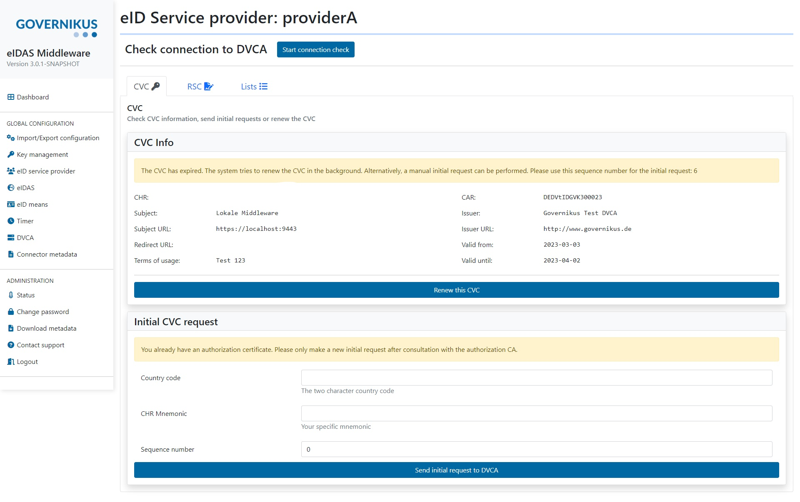

.. include:: snmpshortcuts.rst

.. _operating:

Operating the server
====================================

.. _startup_and_shutdown:

Startup and shutdown
--------------------
The commands for starting and stopping vary between the different environments.

Plain eIDAS Middleware JAR
^^^^^^^^^^^^^^^^^^^^^^^^^^
If you choose to use just the JAR in your own environment, execute the following commands to start the
eIDAS Middleware. ::

    # cd into the folder where the eidas-middleware.jar is located in
    java -jar eidas-middleware.jar

If the configuration files are not located in a subdirectory called ``config`` of your current working directory, you
must specify the location of the configuration directory. Note that the path must end with a `/`::

    java -jar eidas-middleware.jar --spring.config.additional-location=file:/path/to/your/configuration-directory/

To stop the eIDAS Middleware execute ``CTRL+C``.
Alternatively you can also send ``SIGTERM`` with ``kill [PID of the middleware]``.

Based on these commands you can write your own scripts for starting and stopping.

VirtualBox Image
^^^^^^^^^^^^^^^^
In the image you can execute the same commands as for the plain eIDAS Middleware JAR.
The JAR file is located in ``/opt/eidas-middleware``.

In addition to starting the middleware directly, you can use systemd to start and stop the application.

.. code-block:: none

    sudo systemctl start eidas-middleware.service
    sudo systemctl stop eidas-middleware.service

To start the application on boot, execute the following line.

.. code-block:: none

    sudo systemctl enable eidas-middleware.service

.. hint::
    The eidas-middleware.service contains hard coded paths for the java installation and the name of the application.
    When you update or rename your java installation or the application, you must adapt the paths in the service file.

Docker
^^^^^^
The configuration and database of the middleware are located in named volumes.
This way you can stop and remove the middleware Docker container and create a new one to restart the application.

To run the eIDAS Middleware, execute the following command.
It will mount the named volumes containing the database and configuration in the container
and the application will be available on port 8443. ::

    docker run --rm -it -v eidas-configuration:/opt/eidas-middleware/configuration -v eidas-database:/opt/eidas-middleware/database -p 8443:8443 --name eidas-middleware-application governikus/eidas-middleware-application:3.2.0

To stop and remove the container, just hit ``CTRL+C``.

To keep the container running longer without being attached to the STDOUT and STDERR, change the command to
the following::

    docker run -d -v eidas-configuration:/opt/eidas-middleware/configuration -v eidas-database:/opt/eidas-middleware/database -p 8443:8443 --name eidas-middleware-application governikus/eidas-middleware-application:3.2.0

For more information on starting and stopping containers and viewing the logs,
see the `Docker Docs <https://docs.docker.com/engine/reference/run/>`_.

As mentioned before, the eIDAS Middleware application configuration is located in the named volume.
If you want to change the TLS key store or disable https because you are using a reverse proxy,
you should use the admin interface to modify the configuration
instead of adding environment variables to the Docker run command.

To use this container with Docker Compose, see the example Docker Compose file at `GitHub <https://github.com/Governikus/eidas-middleware/blob/master/eidas-middleware/docker-compose/docker-compose.yaml>`_.
You can use docker-compose.yaml out of the box to start the eIDAS Middleware application. ::

    cd eidas-middleware/docker-compose
    docker-compose up

To stop the container, hit ``CTRL+C``. To remove the container afterwards, execute ``docker-compose down``.

Obtain authorization certificate
--------------------------------

When the middleware is running, direct your browser to the admin interface at
``https://<YOUR_SERVERURL>:<YOUR_ADMIN_PORT>/admin-interface``.

After logging in, you will see your :term:`eID Service Providers<eID Service Provider>` in the dashboard
(assuming you have already completed the configuration as in :ref:`configuration-mw`).
Please open the details for the provider you want to obtain the certificate for.

By clicking the button ``Start connection check`` you can check the connection to the :term:`Authorization CA`.
If this check does not succeed, take a look in the log for more details.
Possible errors are firewalls that block the connection to the :term:`Authorization CA` or the :term:`Authorization CA`
has not yet stored your client TLS certificate.
If the error persists, send the log file and your error description to eidas-middleware@governikus.com.

You are also advised to create a :term:`Request Signer Certificate` before you send the initial request.
Navigate to the tab ``RSC``. For private sector :term:`eID Service Providers<eID Service Provider>`,
please enter the holder for the :term:`Request Signer Certificate`
assigned to the provider by the :term:`Authorization CA` and then press `Generate RSC`.
The public sector :term:`eID Service Provider` does not need to enter a holder and can push the button directly.
If the request signer certificate has been successfully generated the button changes to
`Download RSC`. You can download the certificate and forward it to the PoSC or its representative
(production system) / :term:`Authorization CA` (test system).

If the connection check is successful and the :term:`Authorization CA` has confirmed that your Request Signer
Certificate had been processed, you can request the :term:`Authorization Certificate`.
To do that, fill in the form `Start an initial request` with the values that you should have received from the
:term:`Authorization CA`.
If the CA did not specify a sequence number, you can start with 1. Then click on `Send initial request to DVCA`.
If this request was unsuccessful, take a look in the log for more details and double check that the country code and
CHR Mnemonic are correct.
If the error persists, send the log file and your error description to eidas-middleware@governikus.com.

After a successful initial request the eIDAS Middleware should be ready to receive eIDAS requests from your eIDAS
connector.

The eIDAS Middleware automatically renews the :term:`Authorization Certificate`.
It also checks regularly for updates of the :term:`Black List`, :term:`Master List` and :term:`Defect List`.

Additional information
----------------------

Logging
^^^^^^^
The log level can be changed by adding properties to the ``application.properties``. ::

    # change the root level:
    logging.level.root=DEBUG
    # change the logging level only of the middleware specific classes:
    logging.level.de.governikus=DEBUG

For more information, see the `Spring Boot documentation <https://docs.spring.io/spring-boot/docs/current/reference/html/boot-features-logging.html#boot-features-logging>`_.

Startup checks
^^^^^^^^^^^^^^
Beginning with version 2.0.0, the middleware performs some checks when it is started. In detail, these are:

* Is the TLS server certificate valid?
* Is the CVC valid?
* Does the server URL match the one in the CVC?
* Is the TLS server certificate correctly referenced in the CVC?

The results of these checks can be found in the log. Failed checks are reported as warnings,
while successful checks are logged on the info level. Also, you can see the results in the admin interface
and trigger a rerun of the checks there.

Note: The check for TLS certificate validity performs a call to the server URL in order to retrieve the certificate.
If this call is blocked, or routed to a different point than calls originating from the internet,
you may experience false negative results.

VirtualBox Image
^^^^^^^^^^^^^^^^
The operating system is configured to use the official debian sources for updates. Please make sure that updates are
installed on a regular basis. To update the operating system issue the following commands:
``apt-get update && apt-get upgrade``

When using systemd, the eIDAS Middleware log files can be found in the directory ``/var/log/eidas-middleware``.

Scalability
^^^^^^^^^^^
The performance of the eIDAS Middleware improves by adding more memory (RAM) and using a faster CPU.
In case the memory configuration has changed, the server needs to be restarted.
To start the JVM with more memory, add ``-Xmx`` with the new maximum memory size to the start command,
e.g. ``java -Xmx8g -jar eidas-middleware-3.2.0.jar`` for 8 GB.

Request Signer Certificate
^^^^^^^^^^^^^^^^^^^^^^^^^^
Starting with version 2.1.0, the middleware supports :term:`Request Signer Certificates<Request Signer Certificate>`.
These are long-term certificates used to sign requests for
:term:`Authorization Certificates<Authorization Certificate>`, both initial and subsequent.
When you have not yet generated one, you can do so by clicking `Generate RSC`.
After that, the new request signer certificate will automatically be used for any
:term:`Authorization Certificate` request.

This is especially helpful to middleware operators in case the :term:`Authorization Certificate`
expires before it has been renewed, as they can simply sign a new initial request using the
:term:`Request Signer Certificate` and do not need support by the :term:`Authorization CA`

However, in order to accept requests signed with the :term:`Request Signer Certificate`,
the :term:`Authorization CA` needs to know this certificate. You need to download the freshly
generated :term:`Request Signer Certificate` using `Download RSC` and forward
it to the PoSC or its reprensentative (production system) / :term:`Authorization CA` (test system).
As a fallback, the :term:`Authorization Certificate` requests are still signed using certificate chain method when the
:term:`Authorization CA` has not yet processed your new request signer certificate.

When a :term:`Request Signer Certificate` itself is about to expire (the usual validity is 3 years), the middleware will
automatically create a new one and report this both in the log and in the admin interface as you need
to again submit it manually to the :term:`Authorization CA`.
Please check the logs accordingly.

A service to automatically send the :term:`Request Signer Certificate` to the :term:`Authorization CA`
will be implemented in the future.

Automatic renewal of the authorization certificate on invalidation with the request signer certificate
""""""""""""""""""""""""""""""""""""""""""""""""""""""""""""""""""""""""""""""""""""""""""""""""""""""

In case a CVC has expired,
a new CVC can be requested automatically with a request signer certificate.
As long as the expiration date of the CVC is not more than two days ago,
an attempt is made every six hours to request a new CVC with the request signer certificate.
The message *"The CVC has expired. The system tries to renew the CVC in the background. Alternatively,
a manual initial request can be performed"* will be visible in that timespan:

Monitoring
--------------------------------------------------

SNMP Agent (system)
^^^^^^^^^^^^^^^^^^^

The virtual machine we provide has a system :term:`SNMP` agent enabled by default and preconfigured.
With this agent, you can monitor the health status of the server using the SNMP tools of your choice.
You can change the SNMP settings by editing the file ``/etc/snmp/snmpd.conf``.

The configured user name is ``gov`` with authentication protocol SHA and privacy protocol DES, both
passwords ``12345678``.

For example, a snmpwalk on OID 1.3.6.1.2.1.25.4.2.1.4 (HOST-RESOURCES-MIB::hrSWRunPath) will reveal the running
processes.

``snmpwalk -v3 -l authPriv -u gov -a SHA -A 12345678 -x DES -X 12345678 $HOSTNAME 1.3.6.1.2.1.25.4.2.1.4``

Check the output on whether it contains ``java``.

You can monitor CPU, network and memory consumption with the usual OIDs, see `SNMP Documentation
<http://www.debianadmin.com/linux-snmp-oids-for-cpumemory-and-disk-statistics.html>`_ for details.

The following example will show the total RAM usage:

``snmpget -v3 -l authPriv -u gov -a SHA -A 12345678 -x DES -X 12345678 $HOSTNAME 1.3.6.1.4.1.2021.4.6.0``

SNMP Agent (application)
^^^^^^^^^^^^^^^^^^^^^^^^

The middleware application itself also has an internal SNMP agent which can be used to query various data
directly from the application (see below for what is available).
Please note this is a different agent than the one for the system. The system agent is only preconfigured
in the virtual machine, the internal agent is available directly in the middleware application. If you intend
to use both in parallel, you have to make sure that they run on different ports.

To activate the internal SNMP agent it is necessary to set ``poseidas.snmp.username``, ``poseidas.snmp.authpwd``
(authentication password) and ``poseidas.snmp.privpwd`` (encryption password) in the application.properties.
The passwords have a minimum length of 8 characters. The SNMP agent supports ``GET`` and
``GET NEXT`` requests.

Optional properties are ``poseidas.snmp.authalgo`` (authentication algorithm) with one of these values:
md5, sha, hmac128sha224, hmac192sha256, hmac256sha384, hmac384sha512 (hmac384sha512 is the default value when not set),
``poseidas.snmp.privalgo`` (encryption algorithm) with one of these values: des, 3des, aes128, aes192, aes256
(aes256 is the default value when not set).

There are two different ways to use the SNMP agent to monitor the application. It is divided in ``GET`` and ``TRAP``.

Optional properties for ``GET`` and ``GET NEXT`` requests can be set in the application.properties:
``poseidas.snmp.agenthost`` with the default value set to localhost and ``poseidas.snmp.agentport`` with the default
value set to port 161.

For monitoring the ``TRAPs`` it is also necessary to set ``poseidas.snmp.managementhost`` in the
application.properties.

Optional property for ``TRAP`` is ``poseidas.snmp.managementport`` (port 162 is the default value when not
set).

All existing SNMP GET values are explained in detail in the MIB located at
``https://github.com/Governikus/eidas-middleware/blob/3.2.0/poseidas/snmp/EIDASMW-SNMP-MIB.mib``.

Global GET
''''''''''

.. csv-table::
    :widths: 75 50 45
    :delim: ;

    OID; GET (Return value datatype); Description
    |CRL_GET_LAST_SUCCESSFUL_RETRIEVAL|; lastSuccessfulCRLRetrieval (DateAndTime); The timestamp for the last successful retrieval of a certificate revocation list is returned
    |CRL_GET_AVAILABLE|; isCRLAvailable (Integer32); 0: A certificate revocation list is present. 1: No certificate revocation list is present
    |GET_TLS_CERTIFICATE_VALID|; tlsCertificateExpirationDate (DateAndTime); Expiration date of the server certificate

Provider specific GET
'''''''''''''''''''''

Governikus OID = |GOVERNIKUS_OID|
eIDAS Middleware prefix = |EUMW_PREFIX|
Get prefix = |GET_PREFIX|

.. csv-table::
    :widths: 75 45 50
    :delim: ;

    OID; GET (Return value datatype); Description
    |PROVIDER_NAME_GET|; serviceProviderName (OCTET STRING); The service provider name used for identifying instances of the columnar objects in the serviceProviderTable
    |CVC_GET_PRESENT|; cvcPresent (Integer32); CVC present: 0 = not present, 1 = present
    |CVC_GET_VALID_UNTIL|; cvcExpirationDate (DateAndTime); Date until the CVC is valid
    |CVC_GET_SUBJECT_URL|; cvcSubjectUrl (OCTET STRING); The Subject URL of the CVC
    |CVC_GET_TLS_CERTIFICATE_LINK_STATUS|; cvcAndTlsLinked (Integer32); TLS server certificate referenced in CVC: 0 = not linked, 1 = linked
    |BLACKLIST_GET_LIST_AVAILABLE|; blackListAvailable (Integer32); Black List availability: 0 = not available, 1 = available
    |BLACKLIST_GET_LAST_SUCCESSFUL_RETRIEVAL|; lastBlackListRenewal (DateAndTime); Date of last successful Black List renewal
    |BLACKLIST_GET_DVCA_AVAILABILITY|; blackListCAAvailable (Integer32); Black List PKI availability: 0 = not available, 1 = available
    |MASTERLIST_GET_LIST_AVAILABLE|; masterListAvailable (Integer32); Master List availability: 0 = not available, 1 = available
    |MASTERLIST_GET_LAST_SUCCESSFUL_RETRIEVAL|; lastMasterListRenewal (DateAndTime); Date of last successful Master List renewal
    |MASTERLIST_GET_DVCA_AVAILABILITY|; masterListCAAvailable (Integer32); Master List PKI availability: 0 = not available, 1 = available
    |DEFECTLIST_GET_LIST_AVAILABLE|; defectListAvailable (Integer32); Defect List availability: 0 = not available, 1 = available
    |DEFECTLIST_GET_LAST_SUCCESSFUL_RETRIEVAL|; lastDefectListRenewal (DateAndTime); Date of last successful Defect List renewal
    |DEFECTLIST_GET_DVCA_AVAILABILITY|; defectListCAAvailable (Integer32); Defect List PKI availability: 0 = not available, 1 = available
    |RSC_GET_PENDING_AVAILABLE|; rscPendingAvailable (Integer32); Pending RSC availability: 0 = not available, 1 = available
    |RSC_GET_CURRENT_CERTIFICATE_VALID_UNTIL|; rscCurrentValidUntil (DateAndTime); Last date of RSC validity

TRAP
''''

The following table will show the OIDs and their meaning.

Governikus OID = |GOVERNIKUS_OID|
eIDAS Middleware prefix = |EUMW_PREFIX|
Trap prefix = |TRAP_PREFIX|

.. csv-table::
    :widths: 70 50 50
    :delim: ;

    OID; Description; Messages (Datetype)
    |CVC_TRAP_LAST_RENEWAL_STATUS|; The status of the last renewal of the CVC; 0 = success, 1 = failed (Integer32)
    |BLACKLIST_TRAP_LAST_RENEWAL_STATUS| ; The status of the last renewal of the Black List; 0 = renewed, 1 = no list received, 2 = list signature check failed, 3 = list processing error (Integer32)
    |BLACKLIST_TRAP_LAST_RENEWAL_PROCESSING_DURATION|; The last renewal processing duration of the Black List; The duration in milliseconds (long)
    |MASTERLIST_TRAP_LAST_RENEWAL_STATUS|; The status of the last renewal of the Master List; 0 = renewed, 1 = no list received, 2 = list signature check failed, 3 = list processing error (Integer32)
    |MASTERLIST_TRAP_LAST_RENEWAL_PROCESSING_DURATION|; The last renewal processing duration of the Master List; The duration in milliseconds (long)
    |DEFECTLIST_TRAP_LAST_RENEWAL_STATUS|; The status of the last renewal of the Defect List; 0 = renewed, 1 = no list received, 2 = list signature check failed, 3 = list processing error (Integer32)
    |DEFECTLIST_TRAP_LAST_RENEWAL_PROCESSING_DURATION|; The last renewal processing duration of the Defect List; The duration in milliseconds (long)
    |CRL_TRAP_LAST_RENEWAL_STATUS|; The status of the last renewal of the Certificate Revocation List; 0 = success, 1 = failed (Integer32)
    |RSC_TRAP_CHANGE_TO_CURRENT_RSC|; A pending Request Signer Certificate is now current; 0 = success, 1 = failed because there is no pending rsc, 2 = failed because there is no RefID (Integer32)
    |RSC_TRAP_NEW_PENDING_CERTIFICATE|; A new pending Request Signer Certificate has been generated; Certificate information (OCTET STRING)

Test mode
---------

The eIDAS middleware includes a test mode to demonstrate handling various errors. To do this, a RequestedAuthnContext
must be added to the SAML request, e.g. ::

    <saml2p:RequestedAuthnContext Comparison="minimum">
        <saml2:AuthnContextClassRef xmlns:saml2="urn:oasis:names:tc:SAML:2.0:assertion">test</saml2:AuthnContextClassRef>
    </saml2p:RequestedAuthnContext>

Possible values are: ::

    test
    test#CANCELLATIONBYUSER
    test#WRONGPIN
    test#WRONGSIGNATURE
    test#CARDEXPIRED
    test#UNKNOWN
